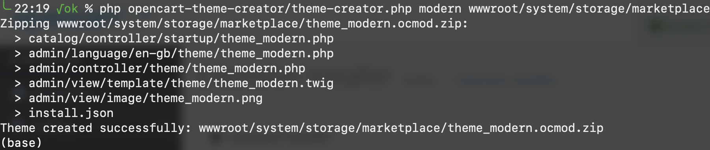
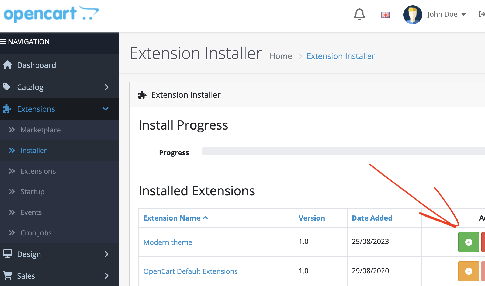
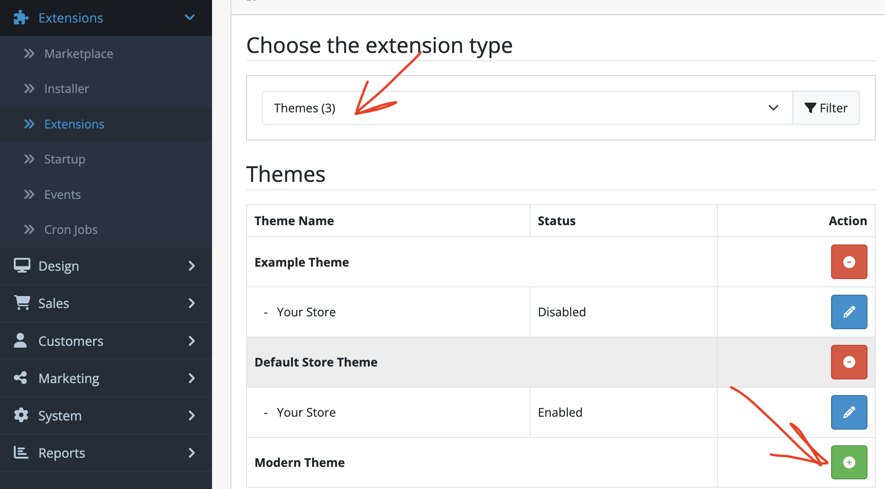
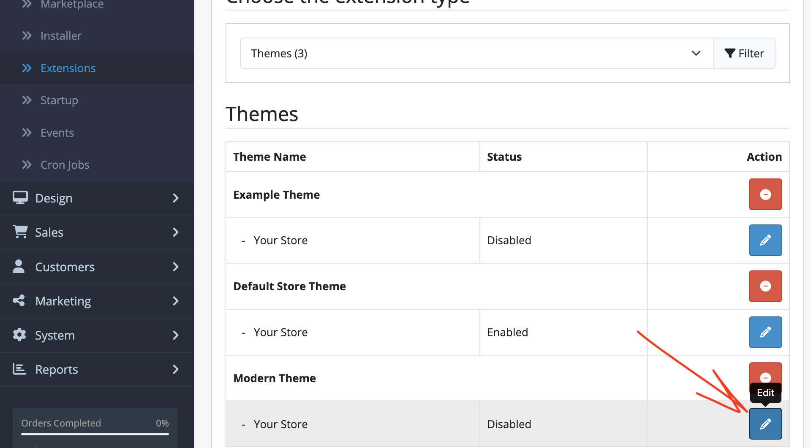
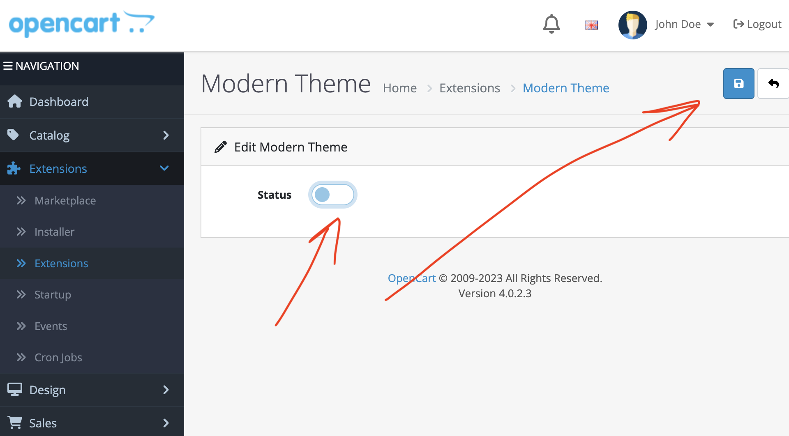

# OpenCart v4.0.2.2 Theme creator
Theme creator for OpenCart v4.0.2.2 to:
1. Configure: name, output_dir, output_file, version, author_name, author_link.


2. Write an extension package: copy template files from `./files` in new temporary folder, replace in the file content and in file names:
    - %name% with $name;
    - %theme_name% with $theme_name, `$theme_name = 'theme_' . preg_replace('/^theme[\_]*/ig', '', $name)`;
    - %ThemeName% with PascalCase of $theme_name;
    - %version% with $version;
    - %author_name% with $author_name;
    - %author_link% with $author_link;
    archive to `$theme_name.ocmod.zip` in the $output_dir | $output_file.;
3. Open Admin area and go to Extensions >> Installer and find a created theme recently.


4. Add it to the system.


5. Go to Extensions >> Extensions >> Choose the extension type [Themes] and add your theme.


6. Activate your theme.



```bash
Usage:
php ./theme-creator.php [name] [output_dir|output_file] [-a author_name] [-u author_link] [-v version]
    name        - The name of the theme (Theme or theme_ prefixes omitting).
    output_dir  - The path to the system/storage/marketplace directory or another one if you wish.
    output_file - The path to the archived ${theme_name}.ocmod.zip file if ends up with .zip.
    author_name - Name of the theme's author, default is "Yaro".
    author_link - Link to the website of the theme's author, default is https://code.yaro.page/.
    version     - The version, default is 1.0.
```
